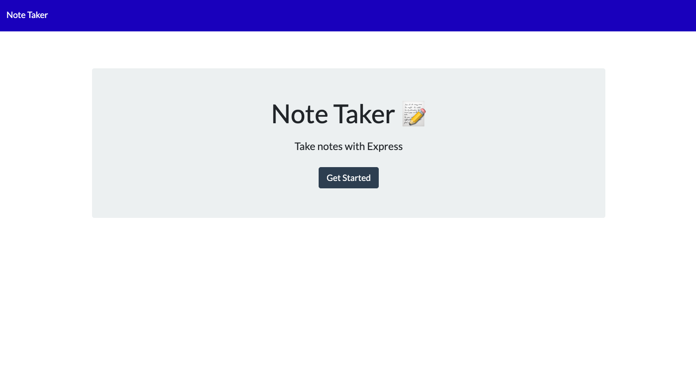
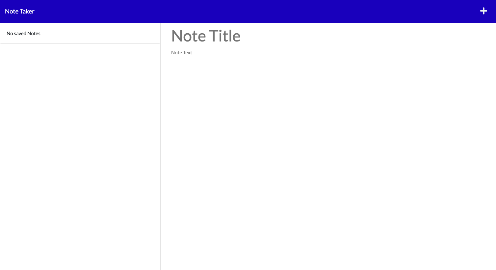

# note-taker
  
  
  Check out the badges hosted by [shields.io](https://shields.io/).
  
  ## Description 
  
  
  A simple note taking application that allows you to save notes with a title.
  ## Table of Contents
  * [Installation](#installation)
  * [Usage](#usage)
  * [Contributing](#contributing)
  * [Tests](#tests)
  * [License](#license)
  

  


  
  


  ## Installation
  
  
  Clone repo:```git@github.com:juanestuniga/note-taker.git```
  
  ## Usage 
  
  
  Run ``npm install``   run ``node server.js``. 
  
  The note app is live on heroku as well for you to use:

  https://note-taking-application-juan.herokuapp.com/
  
  ## Contributing
  
  
  Juan Zuniga
  
  ## Tests
  
  
  N/A
  
  ## License
  
  MIT
  
  ---
  
  ## Questions?
  
  
  For any questions, please contact me with the information below:
 
  GitHub: [@juanestuniga](https://api.github.com/users/juanestuniga)